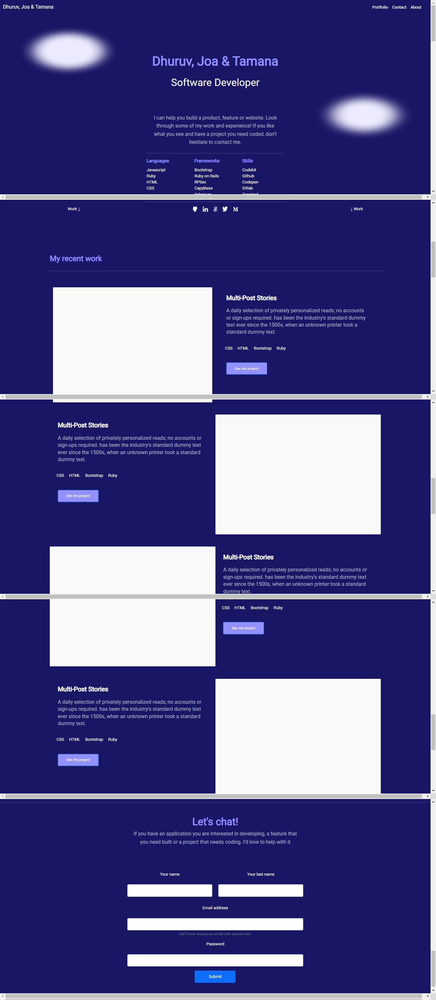

# Try Bootstrap

> Understanding the concept of CSS frameworks and getting started with documentation for CSS frameworks.

## Built With

- html and bootstrap styles
- visual studio code

## Authors

👤 **joa**

- GitHub: [@joa-byte](https://github.com/joa-byte)
- LinkedIn: [LinkedIn](https://www.linkedin.com/in/joa-lorenzo/)

👤 **Dhuruv Singh**

- GitHub: [@DhuruvSingh](https://github.com/DhuruvSingh)
- Twitter: [@Ritiksi76216487](https://twitter.com/Ritiksi76216487)
- LinkedIn: [dhuruv-singh-a1a51aa9](https://www.linkedin.com/in/dhuruv-singh-a1a51aa9/)

👤 **Balkhi**

- GitHub: [@tamana-Balkhi](https://github.com/tamana-Balkhi)

## 🤝 Contributing

Contributions, issues, and feature requests are welcome!

## Show your support

Give a ⭐️ if you like this project!

## 📝 License

This project is [MIT](./MIT.md) licensed.

## View of the page

